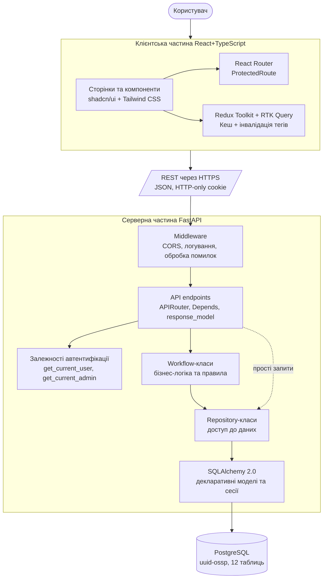

# Рис. 2.1.1. Шарова архітектура системи LunchTogether

Діаграма ілюструє основні шари клієнт-серверного додатку та напрямки залежностей
між ними. Запити користувача проходять зверху вниз: від React-клієнта через
HTTP/REST до серверної частини на FastAPI, далі через бізнес-логіку (Workflow)
до шару доступу до даних (Repository), що працює із PostgreSQL через
SQLAlchemy.

**Використовується у розділах:** 2.1, 2.6.

