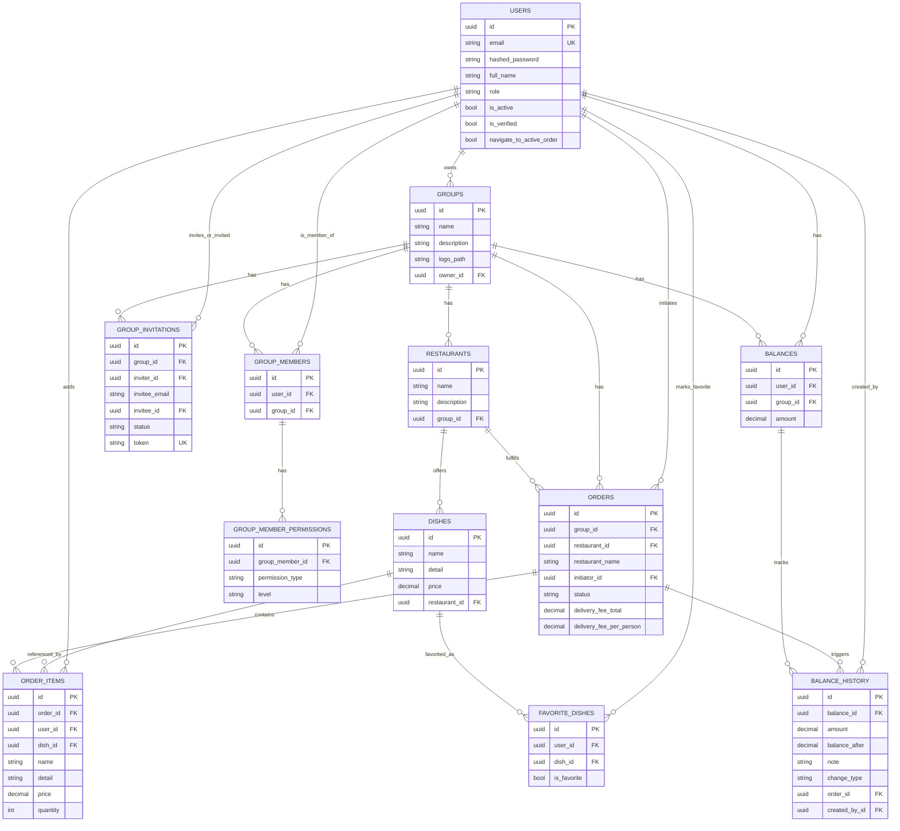

# Рис. 2.3.1. ER-діаграма бази даних

Діаграма описує реляційну схему бази даних PostgreSQL із дванадцятьма
сутностями та зовнішніми ключами між ними. Усі сутності наслідують спільні поля
`id` (UUID), `created_at` та `updated_at`. Ключові обмеження унікальності
позначено через `UQ` у назві ключа.

**Використовується у розділах:** 2.3, 3.3.

