# Рис. 1.4.1. Діаграма прецедентів використання

Діаграма групує основні сценарії використання за функціональними областями
системи та зв'язує їх з акторами: незареєстрованим відвідувачем (Гість),
звичайним користувачем, власником групи (особливий випадок учасника із роллю
Admin усередині групи) та системним адміністратором. Стрілки «extends»
позначають похідні сценарії, що використовують основний.

**Використовується у розділах:** 1.4, 2.5.

```mermaid
flowchart LR
    Guest((Гість))
    Member((Користувач))
    Owner((Власник групи))
    Admin((Системний<br/>адміністратор))

    subgraph AuthArea [Автентифікація]
        UC_Register[Зареєструватися]
        UC_Login[Увійти в систему]
        UC_Logout[Вийти з системи]
    end

    subgraph GroupArea [Управління групами]
        UC_CreateGroup[Створити групу]
        UC_InviteMember[Запросити учасника]
        UC_AcceptInvite[Прийняти запрошення]
        UC_ManagePerms[Налаштувати дозволи учасника]
        UC_RemoveMember[Видалити учасника]
    end

    subgraph RestArea [Ресторани та страви]
        UC_AddRestaurant[Додати ресторан]
        UC_AddDish[Додати страву]
        UC_Favorite[Позначити страву улюбленою]
    end

    subgraph OrderArea [Замовлення]
        UC_InitOrder[Ініціювати замовлення]
        UC_AddItem[Додати позицію до замовлення]
        UC_Confirm[Підтвердити замовлення]
        UC_SetFee[Вказати вартість доставки]
        UC_Order[Позначити як замовлене]
        UC_Finish[Завершити замовлення]
        UC_Cancel[Скасувати замовлення]
    end

    subgraph BalArea [Баланси]
        UC_ViewBalances[Переглянути баланси]
        UC_AdjustBalance[Скоригувати баланс]
        UC_ViewHistory[Переглянути історію балансу]
    end

    subgraph AdminArea [Адміністрування]
        UC_ManageUsers[Адмініструвати користувачів]
        UC_PromoteAdmin[Призначити роль Admin]
        UC_DeactivateUser[Деактивувати користувача]
        UC_ViewAll[Переглядати всі групи системи]
    end

    Guest --> UC_Register
    Guest --> UC_Login
    Guest --> UC_AcceptInvite

    Member --> UC_Login
    Member --> UC_Logout
    Member --> UC_AcceptInvite
    Member --> UC_AddItem
    Member --> UC_Favorite
    Member --> UC_ViewBalances
    Member --> UC_ViewHistory

    Owner --> UC_CreateGroup
    Owner --> UC_InviteMember
    Owner --> UC_ManagePerms
    Owner --> UC_RemoveMember
    Owner --> UC_AddRestaurant
    Owner --> UC_AddDish
    Owner --> UC_InitOrder
    Owner --> UC_Confirm
    Owner --> UC_SetFee
    Owner --> UC_Order
    Owner --> UC_Finish
    Owner --> UC_Cancel
    Owner --> UC_AdjustBalance

    Admin --> UC_ManageUsers
    Admin --> UC_PromoteAdmin
    Admin --> UC_DeactivateUser
    Admin --> UC_ViewAll
```

