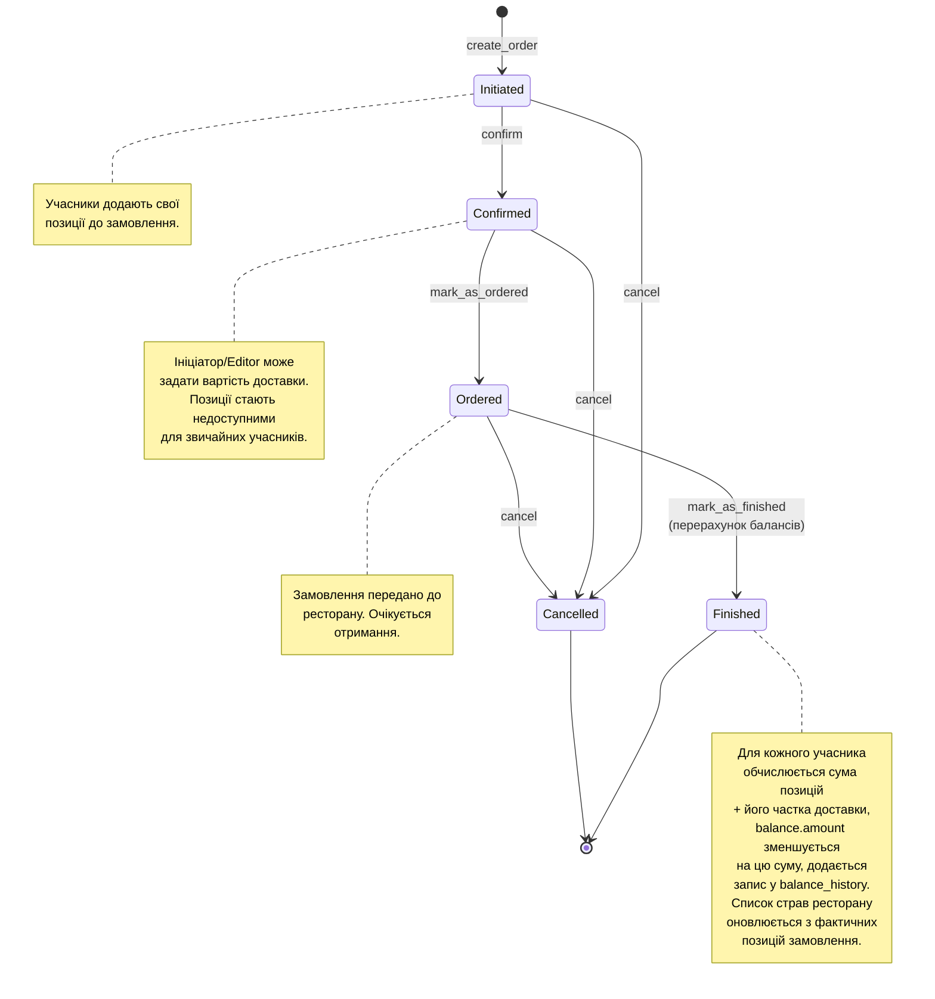

# Рис. 3.5.1. Діаграма станів життєвого циклу замовлення

Діаграма ілюструє валідні переходи між станами замовлення, що визначені у
`OrderLifecycleWorkflow` ([backend/app/workflows/order/lifecycle.py](../../backend/app/workflows/order/lifecycle.py))
константою `VALID_TRANSITIONS`. Усі переходи доступні лише ініціатору
замовлення, користувачу з рівнем дозволу `Orders:Editor` або системному
адміністратору. Перехід у термінальний стан `Finished` автоматично запускає
перерахунок балансів учасників.

**Використовується у розділах:** 1.4, 2.4, 3.5.

