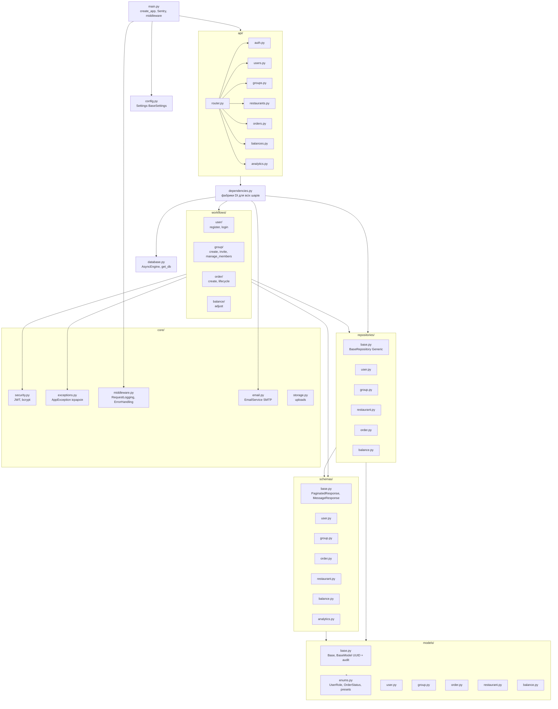

# Рис. 3.1.1. Структура модулів серверної частини

Діаграма відображає основні пакети директорії `backend/app/` та напрямки
імпортів між ними. Стрілка `A --> B` означає «модуль A залежить від модуля B».
Структура реалізує шарову архітектуру: верхні шари (API) можуть викликати
нижні (Workflow → Repository → Models), але не навпаки.

**Використовується у розділах:** 3.1.

