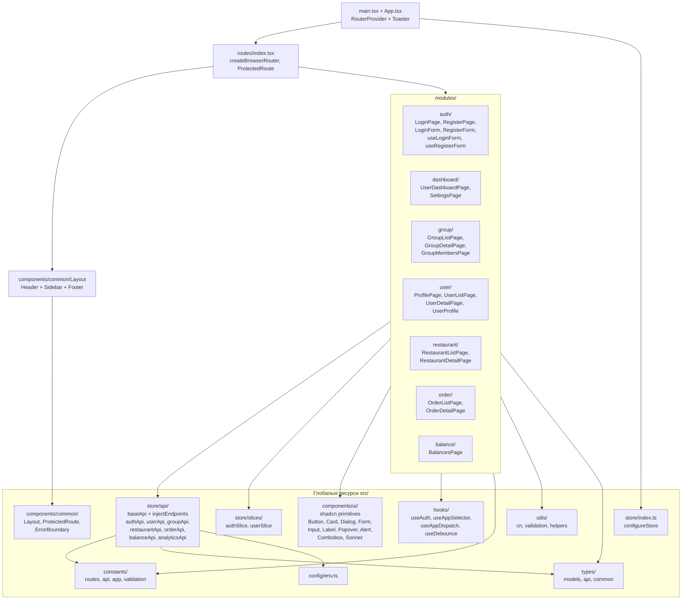

# Рис. 4.1.1. Структура модулів клієнтської частини

Діаграма ілюструє модульну організацію директорії `frontend/src/`. Глобальні
ресурси (store, types, constants, hooks, utils, спільні компоненти) лежать на
верхньому рівні; функціональні розділи додатку винесено у `modules/` із
власними піддиректоріями `pages/`, `components/`, `hooks/`, `types/`. Імпорти
між модулями відбуваються лише через глобальний рівень (через alias `@/`).

**Використовується у розділах:** 4.1.

