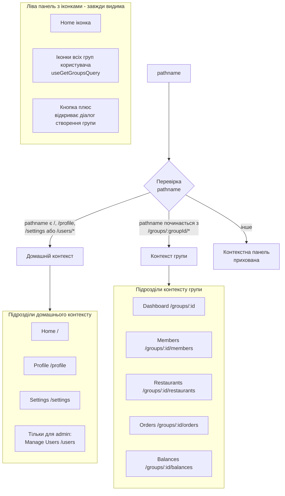

# Рис. 4.5.1. Перемикання контекстів бічної навігації

Двопанельна бічна навігація (`Sidebar` у
[frontend/src/components/common/Layout/Sidebar.tsx](../../frontend/src/components/common/Layout/Sidebar.tsx))
автоматично перемикається між двома контекстами на основі поточного маршруту.
Ліва вузька панель з іконками завжди показує домашню кнопку, список груп та
кнопку створення групи. Права (контекстна) панель показує підрозділи,
релевантні поточному контексту.

**Використовується у розділах:** 4.5, 4.7.

